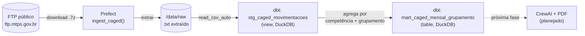
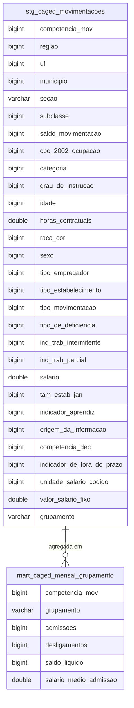

# CAGED Analytics — Nossa Senhora do Socorro/SE

Pipeline de dados educacional que ingere, transforma e (em breve) resume
automaticamente os microdados do **Novo CAGED** (PDET / Ministério do
Trabalho e Emprego), com recorte geográfico fixo em Nossa Senhora do
Socorro/SE, rodando inteiramente num servidor caseiro headless.

## Arquitetura do pipeline



## Estrutura dos dados



`saldo_movimentacao` assume só dois valores: `1` (admissão) ou `-1`
(desligamento) — é a partir dele que `admissoes`, `desligamentos` e
`saldo_liquido` são calculados na mart. `grupamento` é derivado de `secao`
(A=Agropecuária, B-E=Indústria, F=Construção, G=Comércio, H-U=Serviços).

## Stack

| Camada | Ferramenta |
|---|---|
| SO | Ubuntu Server 24.04 LTS (headless) |
| Acesso remoto | SSH (chave) + Tailscale (sem port forwarding) |
| Containers | Docker + Docker Compose |
| Armazenamento e transformação | DuckDB + dbt-core / dbt-duckdb |
| Orquestração | Prefect 3.x |
| Fonte de dado | PDET/Novo CAGED (FTP, `.7z`, mensal, 1 mês de defasagem) |

## Como rodar

```bash
cp .env.example .env   # defina POSTGRES_PASSWORD; o resto tem valor padrão
docker compose up -d
docker compose run --rm pipeline dbt run --project-dir /dbt --profiles-dir /dbt
docker compose run --rm pipeline dbt test --project-dir /dbt --profiles-dir /dbt
```

Só `POSTGRES_PASSWORD` é obrigatória. `PREFECT_HOST` só precisa ser editada se você
acessa a UI do Prefect por outra máquina via Tailscale — sem ele, o padrão é
`localhost` e o clone sobe sem Tailscale.

> O container `pipeline` reinicia em loop até a [F03](docs/fatias/F03-agendamento-real.md)
> ser feita — o `Dockerfile` ainda não tem `CMD`. Postgres, Adminer e Prefect Server
> sobem normalmente.

Backfill de um ano inteiro:
```bash
docker compose run --rm pipeline python -c "from flows.ingest_caged import backfill_caged; backfill_caged(2026)"
```

## Estrutura do repositório

```
.
├── docker-compose.yml
├── pipeline/
│   ├── Dockerfile
│   ├── requirements.txt
│   └── flows/ingest_caged.py
└── dbt/
    ├── dbt_project.yml
    ├── profiles.yml
    └── models/
        ├── staging/stg_caged_movimentacoes.sql
        └── marts/mart_caged_mensal_grupamento.sql
```

## Nota sobre a consolidação do Novo CAGED

Cada competência de **movimentação** (o mês em que a admissão/desligamento
de fato ocorreu) é publicada em três arquivos separados, organizados pela
competência de **declaração**:

- `CAGEDMOVAAAAMM` — movimentações declaradas **dentro do prazo**
- `CAGEDFORAAAAMM` — movimentações declaradas **fora do prazo**
- `CAGEDEXCAAAAMM` — declarações anteriores que foram **excluídas/retificadas**

O pipeline atual ingere **só o `CAGEDMOV`** — ou seja, o saldo calculado hoje
reflete apenas o que foi declarado dentro do prazo, e tende a subestimar
levemente o valor real de competências recentes. Para chegar ao número
definitivo de uma competência de movimentação, é preciso, nos meses
seguintes, somar as declarações fora do prazo e subtrair as exclusões
referentes a ela — isso ainda não está implementado (ver Roadmap).

## Roadmap

- [x] Ingestão automatizada (FTP → `.7z` → `.txt`)
- [x] Transformação e testes de qualidade (dbt + DuckDB)
- [x] Agendamento via Prefect
- [x] Simplificação da arquitetura: remoção do Postgres e do Metabase — DuckDB passa a ser a única camada de dado
- [ ] Ajustes finais de consolidação da migração (revisão de materializações, configs e testes do dbt já 100% DuckDB)
- [ ] Ingestão de `CAGEDFORAAAAMM` (fora do prazo) e `CAGEDEXCAAAAMM` (exclusões)
- [ ] Modelo de reconciliação: mart que combina movimentações + fora do prazo − exclusões, por competência de movimentação
- [ ] Relatório mensal em PDF via CrewAI
  - [ ] Configuração do CrewAI e definição dos agentes (Analista de Dados, Pesquisador de Contexto, Redator, Revisor)
  - [ ] Integração via OpenRouter (modelo a definir)
  - [ ] Criação do layout/template visual do relatório (PDF)
  - [ ] Geração determinística dos fatos (SQL) → narrativa (LLM) → renderização (PDF)