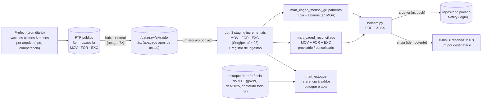
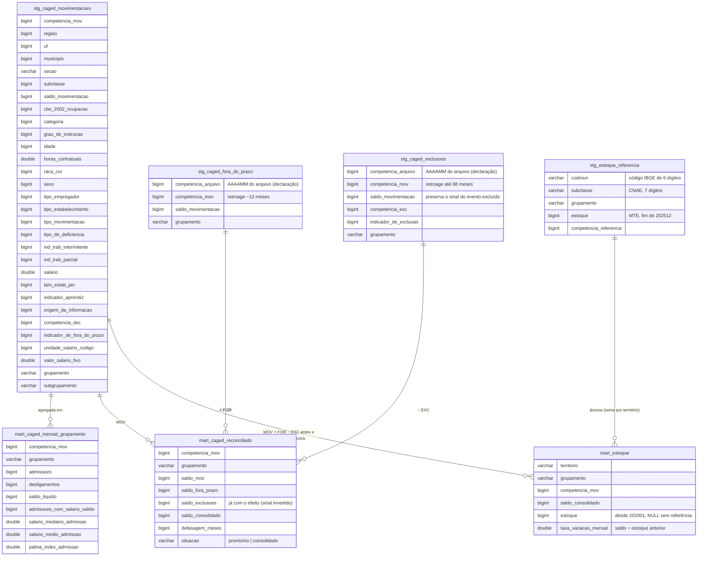

# CAGED Analytics — Nossa Senhora do Socorro/SE

Pipeline de dados educacional que ingere, transforma, reconcilia e **entrega** os microdados do
**Novo CAGED** (PDET / Ministério do Trabalho e Emprego), com recorte geográfico fixo em Nossa
Senhora do Socorro/SE, rodando inteiramente num servidor caseiro headless. A cada competência nova o
pipeline gera um **boletim (PDF) e uma planilha (XLSX)**, guarda os dois num **arquivo protegido por
login** e pode enviá-los por **e-mail** a uma lista.

**Índice:** [Arquitetura](#arquitetura-do-pipeline) · [Dados](#estrutura-dos-dados) · [Como rodar](#como-rodar) ·
[**Referência de comandos**](#referência-de-comandos) · [Variáveis de ambiente](#variáveis-de-ambiente) ·
[Estrutura do repositório](#estrutura-do-repositório) · [Entrega e arquivo](#entrega-por-e-mail-e-arquivo-f15) ·
[Consolidação do CAGED](#nota-sobre-a-consolidação-do-novo-caged) · [Roadmap](#roadmap)

## Arquitetura do pipeline


```mermaid
flowchart LR
    FTP[("FTP público<br/>ftp.mtps.gov.br<br/>MOV · FOR · EXC")]
    SCAN["Prefect (cron diário)<br/>varre os últimos 6 meses<br/>por arquivo (tipo, competência)"]
    RAW[("/data/raw/extraido<br/>.txt (apagado após os testes)")]
    STG["dbt: 3 staging incrementais<br/>MOV · FOR · EXC (Sergipe, uf = 28)<br/>+ registro de ingestão"]
    MART1["mart_caged_mensal_grupamento<br/>fluxo + salários (só MOV)"]
    MART2["mart_caged_reconciliado<br/>MOV + FOR − EXC<br/>provisório / consolidado"]
    MZ[("estoque de referência<br/>do MTE (gov.br)<br/>dez/2025, conferido todo run")]
    MART3["mart_estoque<br/>referência ± saldos<br/>estoque e taxa"]
    BOL["boletim.py<br/>PDF + XLSX"]
    ARQ[("repositório privado<br/>+ Netlify (login)")]
    MAIL["e-mail (Resend/SMTP)<br/>um por destinatário"]

    FTP -->|"baixa + extrai<br/>(apaga .7z)"| RAW
    SCAN --> FTP
    RAW -->|"um arquivo por vez"| STG
    STG --> MART1
    STG --> MART2
    STG --> MART3
    MZ --> MART3
    MART1 --> BOL
    MART2 --> BOL
    BOL -->|"arquiva (git push)"| ARQ
    BOL -->|"envia (idempotente)"| MAIL
```

## Estrutura dos dados


```mermaid
erDiagram
    stg_caged_movimentacoes {
        bigint competencia_mov
        bigint regiao
        bigint uf
        bigint municipio
        varchar secao
        bigint subclasse
        bigint saldo_movimentacao
        bigint cbo_2002_ocupacao
        bigint categoria
        bigint grau_de_instrucao
        bigint idade
        double horas_contratuais
        bigint raca_cor
        bigint sexo
        bigint tipo_empregador
        bigint tipo_estabelecimento
        bigint tipo_movimentacao
        bigint tipo_de_deficiencia
        bigint ind_trab_intermitente
        bigint ind_trab_parcial
        double salario
        bigint tam_estab_jan
        bigint indicador_aprendiz
        bigint origem_da_informacao
        bigint competencia_dec
        bigint indicador_de_fora_do_prazo
        bigint unidade_salario_codigo
        double valor_salario_fixo
        varchar grupamento
        varchar subgrupamento
    }

    mart_caged_mensal_grupamento {
        bigint competencia_mov
        varchar grupamento
        bigint admissoes
        bigint desligamentos
        bigint saldo_liquido
        bigint admissoes_com_salario_valido
        double salario_mediano_admissao
        double salario_medio_admissao
        double palma_index_admissao
    }

    stg_caged_fora_do_prazo {
        bigint competencia_arquivo "AAAAMM do arquivo (declaração)"
        bigint competencia_mov "retroage ~12 meses"
        bigint saldo_movimentacao
        varchar grupamento
    }

    stg_caged_exclusoes {
        bigint competencia_arquivo "AAAAMM do arquivo (declaração)"
        bigint competencia_mov "retroage até 68 meses"
        bigint saldo_movimentacao "preserva o sinal do evento excluído"
        bigint competencia_exc
        bigint indicador_de_exclusao
        varchar grupamento
    }

    mart_caged_reconciliado {
        bigint competencia_mov
        varchar grupamento
        bigint saldo_mov
        bigint saldo_fora_prazo
        bigint saldo_exclusoes "já com o efeito (sinal invertido)"
        bigint saldo_consolidado
        bigint defasagem_meses
        varchar situacao "provisório | consolidado"
    }

    stg_estoque_referencia {
        varchar codmun "código IBGE de 6 dígitos"
        varchar subclasse "CNAE, 7 dígitos"
        varchar grupamento
        bigint estoque "MTE, fim de 202512"
        bigint competencia_referencia
    }

    mart_estoque {
        varchar territorio
        varchar grupamento
        bigint competencia_mov
        bigint saldo_consolidado
        bigint estoque "desde 202001; NULL sem referência"
        double taxa_variacao_mensal "saldo ÷ estoque anterior"
    }

    stg_caged_movimentacoes ||--o{ mart_caged_mensal_grupamento : "agregada em"
    stg_caged_movimentacoes ||--o{ mart_caged_reconciliado : "MOV"
    stg_caged_fora_do_prazo ||--o{ mart_caged_reconciliado : "+ FOR"
    stg_caged_exclusoes ||--o{ mart_caged_reconciliado : "− EXC"
    stg_estoque_referencia ||--o{ mart_estoque : "âncora (soma por território)"
    stg_caged_movimentacoes ||--o{ mart_estoque : "MOV + FOR − EXC antes e depois da âncora"
```

As staging de FOR e EXC têm as mesmas colunas da de MOV (o EXC tem 2 a mais); a tabela acima mostra só as que
importam para a reconciliação. Existe ainda a tabela `ingestao_arquivos` (tipo, competência do arquivo, linhas do
município), escrita pelo flow: é o registro do que já foi carregado.

`saldo_movimentacao` assume só dois valores: `1` (admissão) ou `-1`
(desligamento) — é a partir dele que `admissoes`, `desligamentos` e
`saldo_liquido` são calculados na mart. `grupamento` é derivado de `secao`
(A=Agropecuária, B-E=Indústria, F=Construção, G=Comércio, H-U=Serviços).

## Stack

| Camada | Ferramenta |
|---|---|
| SO | Ubuntu Server 24.04 LTS (headless) |
| Acesso remoto | SSH (chave) + Tailscale (sem port forwarding) |
| Containers | Docker + Docker Compose |
| Armazenamento e transformação | DuckDB + dbt-core / dbt-duckdb |
| Orquestração | Prefect 3.x |
| Fonte de dado | PDET/Novo CAGED (FTP, `.7z`, mensal, 1 mês de defasagem) |

## Como rodar

```bash
cp .env.example .env                       # ajuste o que precisar (ver "Variáveis de ambiente")
docker compose up -d                       # sobe o Prefect Server e o pipeline (worker + agendamento)
docker compose run -d --rm --name backfill pipeline python flows/ingest_caged.py backfill 2020..2026
docker logs -f backfill                    # acompanha a carga do histórico
```

Todas as variáveis têm valores padrão. `PREFECT_HOST` só precisa ser editada se você acessa a UI do Prefect
por outra máquina via Tailscale (padrão: `localhost`, e o clone sobe sem Tailscale).

O container `pipeline` roda contínuo: ao subir, aplica o deployment declarado em `prefect.yaml`
(`prefect deploy --all`) e inicia um worker (`prefect worker start --pool default`) que consome o schedule
cron diário às 3h UTC (meia-noite em Brasília). A UI do Prefect fica em `http://localhost:4200` (ou no IP
Tailscale). Só há **uma porta pública**: a do SSH.

**Regras que valem para todos os comandos abaixo**

- Comandos do projeto rodam **dentro** do container `pipeline`, que já tem o Python, o dbt e os segredos.
- Use **`exec -u caged`** (e não só `exec`) nos comandos que escrevem em `data/`: como `root`, o clone do
  arquivo e os arquivos do warehouse ficam com dono `root` e o flow diário passa a falhar por permissão.
- **Um escritor por vez no DuckDB.** Não rode `backfill`, `dbt run` ou `entrega.py` enquanto o flow diário
  (03:00 em Maceió = 06:00 UTC) estiver processando; consultas de leitura só falham se houver escritor ativo.
- `docker compose up -d --build` **recria** o container `pipeline`: só faça isso sem nenhum flow em execução.

---

## Referência de comandos

### 1. A stack

```bash
docker compose up -d                 # sobe (ou aplica mudanças de configuração)
docker compose up -d --build         # idem, reconstruindo a imagem (depois de mudar pipeline/flows ou requirements)
docker compose ps                    # estado dos containers
docker compose logs -f pipeline      # log do worker e dos flows
docker compose down                  # derruba (os dados em data/ ficam)
```

### 2. Ingestão do FTP (`ingest_caged.py`)

O PDET publica **três arquivos por competência**: `CAGEDMOV` (dentro do prazo), `CAGEDFOR` (fora do prazo, soma) e
`CAGEDEXC` (exclusões, subtrai). O flow decide por **arquivo (tipo, competência)** e pula o que já está carregado.

**Flow diário** (`ingest-caged`): automático, varre os últimos 6 meses. Para disparar na hora, sem esperar o cron:

```bash
docker compose exec -u caged pipeline prefect deployment run 'ingest-caged/caged-ingest-daily'
```

**Backfill** (histórico, sob demanda):

```bash
python flows/ingest_caged.py backfill <ano | ano..ano> [--tipos MOV,FOR,EXC] [--refazer]
```

| opção | efeito |
|---|---|
| `<ano>` ou `<ano>..<ano>` | um ano, ou um intervalo de anos (cada ano é um flow run) |
| `--tipos FOR,EXC` | só esses tipos. `FOR` e `EXC` são pequenos (~1 MB); só o `MOV` pesa (~45 MB) |
| `--refazer` | reprocessa mesmo o que já está carregado (por padrão pula) |

```bash
# histórico inteiro dos arquivos pequenos (FOR e EXC), ~30 min, sobrevive a queda da conexão (-d)
docker compose run -d --rm --name backfill-fe pipeline python flows/ingest_caged.py backfill 2020..2026 --tipos FOR,EXC
docker logs -f backfill-fe

# só um ano, todos os tipos
docker compose run -d --rm --name backfill pipeline python flows/ingest_caged.py backfill 2025

# refazer um ano já carregado
docker compose run -d --rm --name backfill pipeline python flows/ingest_caged.py backfill 2026 --refazer
```

Use `-d` (e `docker logs -f`) para cargas longas: sem ele, uma queda do terminal encerra o container. O backfill
baixa e extrai **todos** os arquivos do ano antes de transformar: um ano de MOV ocupa ~5 GB temporários em disco
(apagados depois que os testes passam).

### 3. dbt (depuração)

O flow já roda o dbt; estes comandos servem para depurar. A staging é **incremental, um arquivo por vez**
(`--vars` com a competência do arquivo): nunca leia todas as competências de uma vez em produção (ver "Por que incremental").

```bash
D="--project-dir /dbt --profiles-dir /dbt"

# staging de um arquivo (tipo: stg_caged_movimentacoes | stg_caged_fora_do_prazo | stg_caged_exclusoes)
docker compose run --rm pipeline dbt run --select stg_caged_fora_do_prazo --vars '{"competencia_arquivo": "202607"}' $D

# os dois marts (fluxo e reconciliado)
docker compose run --rm pipeline dbt run --select path:models/marts $D

# reconciliado com outro limite de "provisório" (padrão: 12 meses)
docker compose run --rm pipeline dbt run --select mart_caged_reconciliado --vars '{"meses_para_consolidar": 18}' $D

# todos os testes (ou um só)
docker compose run --rm pipeline dbt test $D
docker compose run --rm pipeline dbt test --select test_continuidade_for_exc $D
```

Testes de qualidade: os `error` derrubam o run; os de plausibilidade de salário e o de continuidade FOR/EXC são
`warn` (D04): não derrubam, mas geram alerta.

### 4. Entrega e arquivo (`entrega.py`)

O boletim vem do **mart**, nunca do raw. O que foi **enviado** fica arquivado e não se regenera de forma
silenciosa. Todos os comandos:

```bash
docker compose exec -T -u caged pipeline python flows/entrega.py <comando> ...
```

| comando | o que faz | e-mail | estado no `envios.json` |
|---|---|---|---|
| `teste [AAAAMM]` | gera e manda **só para `EMAIL_TESTE`**; não arquiva nem registra | 1, para o dono | não mexe |
| `enviar AAAAMM` | gera (ou reaproveita o que já está arquivado), arquiva e envia à lista; idempotente | sim, um por destinatário | `enviando` → `enviado` |
| `arquivar AAAAMM[..AAAAMM] ...` | gera e **só arquiva**, sem e-mail | **não** | `arquivado` (com `sha256`) |
| `remover AAAAMM ...` | apaga do arquivo (continua no histórico do git) | não | remove a entrada |

`arquivar` aceita `--refazer` (substitui o que está só arquivado) e `--incluir-enviados` (também substitui o que
consta como enviado). `remover` aceita `--incluir-enviados`.

**Estados e o que cada um permite**

| estado no `envios.json` | significa | envio automático | `arquivar --refazer` | `remover` |
|---|---|---|---|---|
| (sem entrada) | não existe / nunca processada | envia, se for a mais recente | gera | — |
| `arquivado` | guardada **sem** enviar | **pula** (arquivar nunca vira e-mail) | **substitui** | remove |
| `enviando` | envio em andamento ou interrompido (órfão) | alerta, **nunca reenvia** | **nunca toca** | **nunca toca** |
| `enviado` | foi mandada à lista | não repete | **protegida** (só com `--incluir-enviados`, e o envio anterior fica em `substitui_envio`) | protegida |

**Desfecho impresso por competência:** `arquivada` (nova) · `refeita` · `ja_arquivada` (já existe e não foi pedido
`--refazer`) · `protegida` (consta como enviada) · `em_envio` · `sem_dados` (a competência não está no mart) ·
`removida` · `inexistente`.

**Receitas**

```bash
E="docker compose exec -T -u caged pipeline python flows/entrega.py"

# 1) validar o e-mail antes de qualquer envio real (chega só para EMAIL_TESTE)
$E teste 202607

# 2) guardar boletins só no arquivo, sem avisar ninguém (um commit e um deploy para o lote)
$E arquivar 202601..202606
$E arquivar 202601 202603 202607          # competências avulsas

# 3) desenvolvimento: os boletins mudaram? Regenere tudo o que está só arquivado, antes de abrir ao público
$E arquivar 202001..202607 --refazer

# 4) substituir também o que constava como enviado (o envio anterior fica registrado em substitui_envio)
$E arquivar 202607 --refazer --incluir-enviados

# 5) apagar do arquivo (e gerar outro depois, se quiser)
$E remover 202607
$E arquivar 202607

# 6) enviar à lista uma competência já arquivada (reaproveita os MESMOS bytes)
$E enviar 202606
```

O **envio automático** (`ENTREGA_HABILITADA=true`) só considera a competência **mais recente** do mart; reconstruir
o warehouse ou fazer backfill de anos antigos **nunca** dispara e-mail.

**Envio órfão** (`enviando` que não virou `enviado`): o processo caiu no meio e ninguém sabe quem recebeu. Não é
reenviado sozinho; o alerta se repete a cada run. Como resolver está em [arquivo/README.md](arquivo/README.md#resolver-um-envio-órfão).

### 4b. Boletim com IA: revisão, aprovação e envio (`entrega_ia.py`, F19)

Nada é automático. Os administradores (`secrets/destinatarios_admin.txt`) recebem o rascunho
primeiro; só depois da aprovação o boletim vai para a lista principal e para o arquivo.

```bash
docker compose run --rm pipeline python flows/boletim_ia.py 280480 202607                     # gera
docker compose run --rm pipeline python flows/entrega_ia.py revisar 280480 202607             # PDF + relatório só aos admins
docker compose run --rm pipeline python flows/entrega_ia.py aprovar 280480 202607 --por "Nome"
docker compose run --rm pipeline python flows/entrega_ia.py enviar  280480 202607             # lista principal + arquivo
```

**Primeiro uso:** crie `secrets/destinatarios_admin.txt` (um e-mail por linha, fora do git) e
defina no `.env` a lista `IA_MODELOS_PERMITIDOS` e, de preferência, o modelo de cada papel. Exemplo
usado nos testes reais de 29/09/2026 (~US$ 0,03 por boletim):

```
IA_MODELOS_PERMITIDOS=anthropic/claude-sonnet-5.5,google/gemini-3.7-flash,z-ai/glm-5.3-flash,typesafe/jev-1.13
IA_MODELO_REDATOR=google/gemini-3.7-flash
IA_MODELO_ANALISTA=z-ai/glm-5.3-flash
IA_MODELO_REVISOR=z-ai/glm-5.3-flash
```

O Jev (`typesafe/jev-1.13`) entra sozinho como juiz (triagem das dúvidas e das afirmações do texto); nunca redige. O advisor (`IA_MODELO_ADVISOR`, padrão: o 1º modelo de texto se não for o redator) só
responde dúvidas de método, no máximo 2 por boletim.

**Escopo fechado nos fatos:** o boletim só afirma o que os fatos mostram, sem informação externa, e a
geração nunca para para perguntar nada a ninguém. Uma dúvida do analista que exigiria informação de fora
(acontecimentos, obras, deslocamentos) entra na lista `fora_dos_fatos`: o redator é instruído a não afirmar
nada sobre ela, e o relatório de revisão a mostra. O relatório de
revisão mostra primeiro as afirmações que o Jev não viu sustentadas pelos fatos. A chave da
OpenRouter tem limite vitalício de crédito, reajustado à mão todo mês (limita a perda num
vazamento); se ele se esgotar, a OpenRouter recusa a chamada e o comando avisa.

- O PDF é gerado uma vez, na revisão; o envio confere o sha256 e manda exatamente o que foi aprovado.
- Resultado reprovado no verificador não vai à revisão: gere de novo com `--refazer`.
- O envio usa as garantias da F15 com a chave `ia-AAAAMM` no `envios.json` (idempotente; órfão não se
  reenvia sozinho). O índice do arquivo ganha o link "boletim com análise (PDF)".

### 5. O arquivo protegido (Netlify)

O esqueleto está em [`arquivo/`](arquivo/) (o repositório privado real é separado: [F15](docs/fatias/F15-entrega-por-email-e-arquivo.md)).

```bash
# teste de aceite do bloqueio: rode de FORA, sem cookie. Nenhum caminho protegido pode devolver 200
arquivo/scripts/verificar-bloqueio.sh https://caged.obsnss.space
arquivo/scripts/verificar-bloqueio.sh https://caged.obsnss.space /2026-07/boletim-202607.pdf   # inclui caminhos extras

# testes da regra de acesso e build do login (Node 22, sem instalar nada na máquina)
docker run --rm -u 1000:1000 -e HOME=/tmp -v "$PWD/arquivo":/w -w /w node:22-slim sh -c "npm ci && npm test && npm run build"
```

Acesso: só quem tem convite no Netlify Identity **com o papel `leitor`**. Sem papel: `403`; sem login: redirecionamento.
Remover alguém vale em **até ~1 h** (duração do token). O script prova que os caminhos **não são públicos**; que um
arquivo foi de fato publicado só se confirma logado.

### 6. Testes do projeto

```bash
# Python: 149 testes (ingestão, reconciliação e estoque no boletim, apresentação dos PDFs, entrega, arquivo, fatos e proteções de gasto do boletim com IA). Sem rede e sem Prefect rodando
docker compose run --rm --no-deps -v ./pipeline/tests:/app/tests --entrypoint python pipeline -B -m unittest discover -s /app/tests -v

# dbt: testes de qualidade sobre o warehouse real (inclui 2 testes unitários do estoque)
docker compose run --rm pipeline dbt test --project-dir /dbt --profiles-dir /dbt
```

### 7. Consultar o warehouse (somente leitura)

```bash
docker compose exec -T -u caged pipeline python -c "
import duckdb
c = duckdb.connect('/data/warehouse/caged.duckdb', read_only=True)
print(c.execute('''select competencia_mov, sum(saldo_mov) mov, sum(saldo_fora_prazo) fora_prazo,
                          sum(saldo_exclusoes) exclusoes, sum(saldo_consolidado) consolidado, any_value(situacao)
                   from mart_caged_reconciliado where competencia_mov >= 202601 group by 1 order by 1''').fetchall())
# estoque e taxa (F16), total do território
print(c.execute('''select competencia_mov, sum(saldo_consolidado) saldo, sum(estoque) estoque,
                          round(100.0 * sum(saldo_consolidado) / lag(sum(estoque)) over (order by competencia_mov), 2) taxa_pct
                   from mart_estoque where territorio = '280480' group by 1 order by 1 desc limit 6''').fetchall())
"
```

Falha com "lock" se algum flow estiver escrevendo: espere ele terminar.

### 7b. Reconstruir o marco zero (`marco-zero/coletor/`), desativado

> Desde 01/10/2026 o estoque é ancorado no estoque de referência do MTE
> ([F20](docs/fatias/F20-estoque-de-referencia-do-mte.md)) e o marco zero está desativado. O coletor
> continua útil para conferir valores do painel. Para conferir a referência à mão:
> `docker compose exec -u caged pipeline python flows/estoque_referencia.py verificar`.

O marco zero do estoque (F16) vem do painel do MTE. O coletor consulta o painel público de forma
reproduzível, guardando requisições e respostas como evidência. Roda fora do container (precisa de
navegador); detalhes em [marco-zero/coletor/README.md](marco-zero/coletor/README.md).

```bash
cd marco-zero/coletor
python3 -m venv .venv && .venv/bin/pip install -r requirements.txt && .venv/bin/python -m playwright install chromium
cp config.exemplo.json config.json          # territórios e período; o período precisa incluir 202003
.venv/bin/python marco_zero.py executar --config config.json
cd ../..
python3 marco-zero/normalizar.py --coleta marco-zero/coletor/saida/marco-zero-IDENTIFICADOR
```

O `normalizar.py` grava `marco-zero/estoque/` (202003) e `marco-zero/validacao/` (competências
posteriores). Depois, ative o território em `dbt/seeds/territorios.csv`. Sem `--coleta`, ele
regenera a partir dos originais manuais já versionados.

### 7c. Fatos do boletim com IA (`fatos.py`, F19)

O boletim com IA recebe um JSON de fatos calculados por código; nenhum número vem do LLM
([F19](docs/fatias/F19-boletim-com-ia.md), [roteiro](docs/boletim-ia/roteiro.md)).

```bash
docker compose run --rm pipeline python flows/fatos.py 280480 202607 --saida /data/fatos_280480_202607.json
```

Precisa dos marts da F19 (`mart_fluxo`, `mart_perfil_movimentacoes`, `mart_estoque_regiao`,
`mart_salario_admissao`), que o flow cria no próximo `dbt run` dos marts. Limiares dos gatilhos em
`pipeline/perfis/<territorio>.toml`.

O boletim com IA em si (analista → redator → revisor) fica **aguardando aprovação**; nada é enviado.
Por padrão ele acrescenta aos fatos os indicadores do Banco Central (`flows/indicadores.py`): **Pix por
município** (empresas que receberam Pix e valor recebido, em leitura relativa município × região × UF) e a
**Selic** só quando Construção ou Comércio estão em destaque. Sem rede, o indicador fica de fora; `--sem-indicadores`
desliga:

```bash
docker compose run --rm pipeline python flows/boletim_ia.py 280480 202607   # --refazer para gerar de novo
```

O boletim não usa notícias: descreve o que os dados mostram, sem explicar causas.

Mesmos fatos reaproveitam o resultado sem chamar o modelo. Custos em `/data/ia/custos.jsonl`; resultado,
fatos e `boletim.md` em `/data/ia/boletins/<territorio>_<competencia>/<hash>/`.

### 8. Alertas e observabilidade

Sem as variáveis o pipeline roda igual e só avisa no log. Detalhes em [CLAUDE.MD](CLAUDE.MD#observabilidade-e-alertas-f11).

- `NTFY_URL`: alerta ativo (falha de flow, defasagem > 60 dias, testes em WARN, volume suspeito, envio órfão/interrompido).
- `HEARTBEAT_URL`: dead-man's-switch (healthchecks.io). Um ping ao fim de todo run verde, `/fail` em falha; o alerta vem
  da **ausência** do ping (o único que avisa se a máquina inteira parar).

```bash
# teste rápido dos dois canais (dispara um alerta e um ping REAIS)
docker compose exec -T -u caged pipeline python -c "
import sys; sys.path.insert(0, '/app/flows')
from alertas import notificar, ping_heartbeat
print(notificar('CAGED: teste', 'canal ok'), ping_heartbeat())"
```

---

## Variáveis de ambiente

Tudo em `.env` (nunca commitado; `.env.example` é o modelo). Os segredos em **arquivos** ficam em `./secrets/`
(montado somente-leitura em `/secrets`, fora do git).

| variável | para quê | padrão |
|---|---|---|
| `PREFECT_HOST` | host da UI do Prefect (IP Tailscale, se acessar de outra máquina) | `localhost` |
| `NTFY_URL` | tópico ntfy para alertas ativos (o nome do tópico funciona como senha) | vazio = sem alerta |
| `HEARTBEAT_URL` | URL de ping do dead-man's-switch | vazio = sem alerta externo |
| `ENTREGA_HABILITADA` | liga o **envio automático** e o arquivamento no flow diário | `false` |
| `ARQUIVO_REPO_URL` | repositório **privado** do arquivo, em formato SSH (`git@github.com:usuario/repo.git`) | vazio |
| `ARQUIVO_BRANCH` | branch do arquivo | `main` |
| `ARQUIVO_SITE_URL` | endereço do arquivo (vai como link no e-mail) | vazio |
| `SMTP_HOST` / `SMTP_PORT` | servidor SMTP (587 = STARTTLS, 465 = TLS direto; a 25 costuma ser bloqueada) | `587` |
| `SMTP_USER` / `SMTP_PASSWORD` | credencial de **só envio** (Resend: usuário `resend`, senha = chave de API) | vazio |
| `EMAIL_REMETENTE` | `Nome <endereco@dominio-verificado>` | vazio |
| `EMAIL_RESPONDER_PARA` | cabeçalho `Reply-To` (o remetente costuma não ter caixa) | vazio = sem `Reply-To` |
| `EMAIL_SAIR_DA_LISTA` | endereço (ou URL) para sair da lista: cabeçalho `List-Unsubscribe` e corpo | vazio |
| `EMAIL_TESTE` | destino do comando `teste` | vazio |
| `OPENROUTER_API_KEY` | chave **dedicada** da OpenRouter para o boletim com IA (F19), com limite de crédito na própria OpenRouter | vazio = boletim com IA desligado |
| `IA_MODELOS_PERMITIDOS` | ids da OpenRouter que podem rodar, separados por vírgula | vazio = nenhum |
| `IA_ORCAMENTO_MENSAL_USD` | orçamento do mês; cada execução reserva o seu pior caso antes de começar | `2` |
| `IA_PRECO_MAX_SAIDA_USD_MTOK` | teto do preço de saída de um modelo (US$ por milhão de tokens) | `15` |
| `IA_MODELO_REDATOR` | modelo que redige o boletim com IA | 1º modelo de texto de `IA_MODELOS_PERMITIDOS` |
| `IA_MODELO_ANALISTA` / `IA_MODELO_REVISOR` | modelos dos demais papéis; use outra família que a do redator no revisor | último modelo de texto da lista |
| `IA_MODELO_ADVISOR` | modelo mais capaz, só para dúvidas de método (no máximo 2 por boletim) | 1º modelo de texto, se não for o redator |
| `DESTINATARIOS_ADMIN_ARQUIVO` | lista dos administradores que revisam o boletim com IA | `/secrets/destinatarios_admin.txt` |

| arquivo em `./secrets/` | conteúdo |
|---|---|
| `arquivo_deploy_key` | chave SSH **com escrita**, restrita ao repositório do arquivo (`chmod 600`) |
| `destinatarios.txt` | um e-mail por linha (`#` comenta). **Dado pessoal (LGPD)**: nunca no git, nunca em log |
| `destinatarios_admin.txt` | administradores que recebem o rascunho do boletim com IA para revisão (F19). Mesmo formato e mesmos cuidados |

### Permissões

O container ajusta automaticamente o UID/GID do processo para bater com o dono de `data/` e `dbt/` no host (ver
`pipeline/docker-entrypoint.sh`) e, a cada início, devolve ao `caged` o que um `docker exec` como root tenha criado
em `data/`. Não é necessário `chown` manual, mesmo que o usuário do host não seja UID 1000.

### Limpeza de dados

Arquivos baixados do FTP ficam em `data/raw/`. O pipeline **apaga os `.7z` logo após extrair** e, depois que staging,
marts e `dbt test` passam, também os `.txt` (~450 MB o do MOV). Se algo falhar, os `.txt` ficam em disco para
diagnóstico. A detecção de "já ingerido" consulta o warehouse (tabela `ingestao_arquivos`), não o filesystem. O FTP
público continua sendo a fonte de verdade para reprocessar.

### Por que incremental, não `table`

Cada `.txt` do MOV tem ~450-500 MB (o Brasil inteiro; filtramos ~26 mil linhas de Sergipe). Ler todas as competências
de uma vez estoura memória, e o servidor de produção tem **830 MB de RAM**. A staging processa **um arquivo por vez**,
mantendo o pico em ~500 MB (medido: 405 MiB por arquivo MOV com limite de 830 MiB, F16). **Não reverta para `materialized='table'` com leitura por glob** sem resolver isso antes.

## Estrutura do repositório

```
.
├── docker-compose.yml            # 2 serviços: prefect-server, pipeline
├── .env.example                  # modelo das variáveis (o .env real nunca é commitado)
├── secrets/                      # (fora do git) deploy key do arquivo e destinatarios.txt
├── pipeline/
│   ├── Dockerfile · requirements.txt · start.sh · prefect.yaml · docker-entrypoint.sh
│   ├── flows/
│   │   ├── ingest_caged.py       # flow diário + backfill: MOV/FOR/EXC, registro de ingestão
│   │   ├── alertas.py            # ntfy e heartbeat (F11)
│   │   ├── boletim.py            # gera o PDF e o XLSX a partir do mart (F15/F12)
│   │   ├── arquivo.py            # clone do repositório do arquivo, envios.json, índice (git)
│   │   ├── entrega.py            # SMTP, envio idempotente e o CLI: teste/enviar/arquivar/remover
│   │   ├── fatos.py              # JSON de fatos do boletim com IA (F19 parte 1), cada número com id
│   │   ├── ia.py                 # cliente OpenRouter (PydanticAI) e proteções de gasto (F19 parte 2)
│   │   ├── boletim_ia.py         # analista → redator → revisor; resultado aguardando aprovação (F19 parte 3)
│   │   ├── verificador.py        # todo número do texto tem de estar nos fatos (F19 parte 3)
│   │   ├── entrega_ia.py         # revisão pelos admins, aprovação e envio do boletim com IA (F19 parte 5)
│   │   ├── indicadores.py        # Pix por município e Selic (Banco Central) nos fatos (F19 parte 4)
│   │   ├── calibracao.py         # calibra os limiares do Jev com casos de resposta conhecida (F19 parte 6)
│   │   └── comparacao_modelos.py # mesmo boletim por redatores diferentes, às cegas (F19 parte 6)
│   ├── perfis/                   # perfil econômico e identidade visual por território (F19)
│   └── tests/                    # 149 testes Python (ingestão, boletim, PDFs, entrega/arquivo, fatos, IA)
├── dbt/
│   ├── macros/caged.sql          # colunas, CAST e grupamento compartilhados pelas 3 staging
│   ├── macros/estoque.sql        # efeito no saldo (MOV +, FOR +, EXC −), usado pelo estoque (F16)
│   ├── models/
│   │   ├── staging/              # stg_caged_movimentacoes · _fora_do_prazo · _exclusoes · stg_marco_zero_estoque
│   │   └── marts/                # mart_caged_mensal_grupamento · mart_caged_reconciliado · ajuste_marco_zero · mart_estoque
│   ├── seeds/territorios.csv     # territórios do estoque: município ou UF, ativo ou não (F16)
│   └── tests/                    # 18 testes singulares (grão, coerência, salário, sinal do EXC, continuidade, estoque…)
├── marco-zero/                   # estoque do painel do MTE em mar/2020 (único insumo manual) + validação (F16); montado em /marco-zero:ro
│   └── coletor/                  # coleta reproduzível do painel (Playwright), fora do container; alimenta normalizar.py --coleta
├── arquivo/                      # esqueleto do repositório PRIVADO do arquivo (edge function, login, script de aceite)
└── docs/
    ├── fatias/                   # backlog F01…F17 com o registro do que foi feito
    ├── decisoes/                 # D01…D11
    ├── auditorias/               # conferências com fontes externas (mart × painel do MTE)
    └── revisao/                  # a revisão que originou o backlog
```

## Entrega por e-mail e arquivo (F15)

Desligada por padrão (`ENTREGA_HABILITADA=false`). Ligada, o run diário que encontra uma competência nova gera o
boletim e a planilha **a partir do mart**, guarda os dois no repositório privado (publicado no Netlify atrás de
login) e envia **um e-mail por destinatário**. Os comandos manuais estão na [Referência de comandos, seção 4](#4-entrega-e-arquivo-entregapy).

- **O boletim usa o número reconciliado** (MOV + FOR − EXC), com a marcação **provisório/consolidado**; sem o mart
  reconciliado, cai no só-MOV. Os salários são sempre só do MOV.
- **Estoque e variação no mês** (F16/F20) aparecem no resumo, na tabela e na planilha, rotulados como estimativa a
  partir do estoque de referência do MTE; sem `mart_estoque` ou sem referência, o boletim sai sem eles.
- **O estado de envio (`envios.json`) vive no repositório do arquivo**, não no warehouse: apagar o `.duckdb` e
  reconstruí-lo **não reenvia nada**. Sem conseguir ler esse estado, o pipeline não envia (falha fechado).
- **Envio interrompido** vira `enviando` órfão: alerta a cada run e **nunca** é reenviado sozinho.
- **Arquivar nunca envia e-mail**: o status `arquivado` é pulado pelo envio automático.
- **A lista de destinatários é dado pessoal** (`secrets/destinatarios.txt`): fora do git e fora de qualquer log.

Para ligar, nesta ordem (detalhes em [F15](docs/fatias/F15-entrega-por-email-e-arquivo.md) e
[arquivo/README.md](arquivo/README.md)):

1. Publicar o esqueleto de [arquivo/](arquivo/) num repositório **privado** + Netlify e passar em
   `arquivo/scripts/verificar-bloqueio.sh`, antes de qualquer boletim real.
2. Preencher `SMTP_*`, `EMAIL_*` e `ARQUIVO_*` no `.env`; criar `secrets/arquivo_deploy_key` e `secrets/destinatarios.txt`.
3. `docker compose up -d --build` e `... entrega.py teste` (chega só para `EMAIL_TESTE`, sem registrar nada).
4. Só então `ENTREGA_HABILITADA=true`.

## Nota sobre a consolidação do Novo CAGED

Cada competência de **movimentação** (o mês em que a admissão/desligamento
de fato ocorreu) é publicada em três arquivos separados, organizados pela
competência de **declaração**:

- `CAGEDMOVAAAAMM` — movimentações declaradas **dentro do prazo**
- `CAGEDFORAAAAMM` — movimentações declaradas **fora do prazo**
- `CAGEDEXCAAAAMM` — declarações anteriores que foram **excluídas/retificadas**

O pipeline ingere os **três** (F12) e reconcilia: `mart_caged_reconciliado` traz, por
competência de movimentação e grupamento, o saldo só-MOV, o efeito do fora do prazo, o efeito das
exclusões e o **saldo consolidado** (MOV + FOR − EXC). Cada competência é marcada como
**provisória** (menos de 12 meses: ainda pode receber declarações fora do prazo; nos dados, nenhuma
chegou com mais de 12 meses de atraso) ou **consolidada** (só exclusões tardias podem alterá-la:
elas retroagem até 5 anos). As métricas de salário continuam só no mart do MOV.

**Estoque (F16/F20).** `mart_estoque` traz, por território × grupamento × competência, o saldo
consolidado, o **estoque** e a **taxa de variação mensal** (saldo ÷ estoque do mês anterior). O
estoque é ancorado no **estoque de referência do MTE** (gov.br, um arquivo por ano; o de 2026 é o
estoque ao fim de dez/2025), o mesmo que o painel do Novo CAGED usa: para os meses seguintes soma
os saldos, para os anteriores subtrai, até jan/2020. De mar/2020 em diante bate com o painel;
em jan e fev/2020, o estoque de Socorro fica 2 vínculos abaixo do painel, porque recuar até eles passa por mar/2020, mês
em que os microdados divergem do painel ([auditoria](docs/auditorias/2026-09-28-painel-vs-mart-socorro.md)). Todo run do flow confere se o
MTE trocou o arquivo; se trocou, recarrega e recalcula a série
([F20](docs/fatias/F20-estoque-de-referencia-do-mte.md)). Conferido com o painel em 01/10/2026, nos
cinco territórios, em 202003 e 202608. É uma estimativa: muda quando chegam retificadores de meses
passados e quando o MTE atualiza a referência. O marco zero manual de mar/2020
([marco-zero/](marco-zero/FONTE.md)) está desativado.

**Territórios.** A staging guarda Sergipe inteiro (`uf = 28`); os marts de fluxo e o boletim
filtram o município de `municipio_boletim` (280480, em `dbt/dbt_project.yml`). O estoque vale
para os territórios **ativos** em [`dbt/seeds/territorios.csv`](dbt/seeds/territorios.csv)
(município pelo código IBGE de 6 dígitos, ou a UF inteira). Para ativar um, mude `ativo` para
`true` e rode o flow (ou `dbt seed` + marts): não é preciso reprocessar o histórico (já carregado
com Sergipe inteiro em 28/09/2026). Ativos: Socorro, Aracaju, Barra dos Coqueiros, São Cristóvão
e Sergipe (UF). O "Não Identificado" de Sergipe é negativo no próprio painel (o mart o reproduz),
então aparece sempre como WARN em `test_estoque_nao_identificado_negativo`.

Para carregar o histórico dos arquivos pequenos (FOR e EXC de 2020 em diante):

```bash
docker compose run -d --rm --name backfill-fe pipeline python flows/ingest_caged.py backfill 2020..2026 --tipos FOR,EXC
```

## Roadmap

- [x] Ingestão automatizada (FTP → `.7z` → `.txt`)
- [x] Transformação e testes de qualidade (dbt + DuckDB)
- [x] Agendamento via Prefect
- [x] Simplificação da arquitetura: remoção do Postgres e do Metabase — DuckDB passa a ser a única camada de dado
- [x] Ajustes finais de consolidação da migração (revisão de materializações, configs e testes do dbt já 100% DuckDB)
- [x] Ingestão de `CAGEDFORAAAAMM` (fora do prazo) e `CAGEDEXCAAAAMM` (exclusões) — F12
- [x] Modelo de reconciliação: mart que combina movimentações + fora do prazo − exclusões, por competência de movimentação — F12. Conferido com o painel do MTE: 70 de 72 meses idênticos em 2020–2025 ([auditoria](docs/auditorias/2026-09-28-painel-vs-mart-socorro.md))
- [x] Estoque e taxa de variação a partir do marco zero (painel do MTE em mar/2020) — F16 parte 1; 84 de 84 valores idênticos ao painel
- [x] Staging com Sergipe inteiro (`uf = 28`) e territórios configuráveis (`dbt/seeds/territorios.csv`) — F16 parte 2
- [x] Histórico reprocessado com Sergipe inteiro; Aracaju, Barra dos Coqueiros e São Cristóvão ativos — F16 parte 2
- [x] Estoque conferido com o painel nos cinco territórios: 84 de 84 valores em cada
- [x] Sergipe (UF) no estoque; o "Não Identificado" da UF é negativo no próprio painel e tem teste em warn
- [x] Estoque e taxa de variação no boletim (PDF e XLSX), como estimativa a partir de marco zero — F16 parte 3
- [x] Coletor reproduzível do marco zero (`marco-zero/coletor/`) e `normalizar.py --coleta`: um território novo sem digitar número
- [x] Estoque ancorado no estoque de referência do MTE, conferido a cada run; marco zero desativado — [F20](docs/fatias/F20-estoque-de-referencia-do-mte.md)
- [ ] Remover o marco zero de vez, depois de algumas semanas da F20 sem surpresa
- [x] Entrega por e-mail e arquivo autenticado (F15): boletim e planilha arquivados no Netlify (atrás de login) e enviados por e-mail
- [ ] Boletim analítico com IA ([F19](docs/fatias/F19-boletim-com-ia.md), [roteiro](docs/boletim-ia/roteiro.md))
  - [x] Fatos por código: fluxo reconciliado por subgrupamento e divisão CNAE, perfil das admissões, região, acumulados e gatilhos
  - [x] Cliente OpenRouter no PydanticAI com limites de uso, registro mensal de custo (US$ 2/mês) e modelos permitidos
  - [x] Agentes (analista, redator, revisor) e verificador de números
  - [x] Indicadores oficiais: Pix por município e Selic (Banco Central)
  - [x] ~~Evidências externas (notícias)~~: implementadas e removidas em 30/09/2026; o boletim não usa notícias
  - [x] Aprovação humana antes do envio: rascunho aos administradores, aprovação com nome, envio do mesmo PDF
  - [x] Decisão (3b-2): Jev julga afirmações e tria dúvidas; advisor para método; escopo fechado nos fatos, sem tickets (01/10/2026)
  - [ ] Comparação prática de modelos e calibração do Jev
