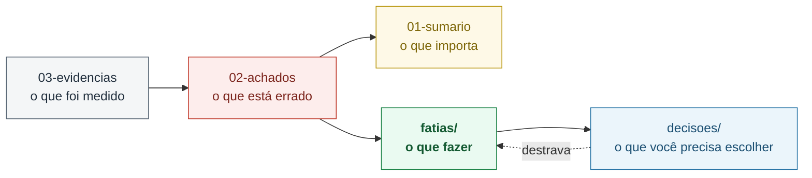

# Documentação do projeto

Documentos gerados pela **revisão geral de 21/09/2026**, considerando os dois
objetivos declarados do projeto: levá-lo a **produção em servidor nuvem**, e usá-lo
como **vitrine profissional** para vagas de analista de dados.

> ⚠️ **Nada aqui foi aplicado ao código.** São propostas para decisão posterior.
> O projeto está exatamente como estava antes da revisão.

## Por onde começar

**[→ Sumário executivo](revisao/01-sumario-executivo.md)** — leia este primeiro.
Veredito, os 5 achados que importam, e o que já está bom.

## Estrutura

```
docs/
├── revisao/
│   ├── 01-sumario-executivo.md    ← comece aqui
│   ├── 02-achados.md              todos os achados, por dimensão
│   └── 03-evidencias.md           como reproduzir cada achado
├── fatias/                        16 unidades de trabalho entregáveis
│   ├── README.md                  backlog ordenado, com grafo de dependências
│   └── F01..F16-*.md
└── decisoes/                      10 escolhas que dependem de julgamento seu
    ├── README.md
    └── D01..D11-*.md
```

## Como estes documentos se relacionam



## Método

Os achados **não vieram de leitura de código**. Cada um foi obtido executando o
sistema — consultando a API do Prefect, lendo o Postgres e o DuckDB, rodando `dbt parse`
sem variáveis de ambiente, conectando ao FTP do PDET, e reproduzindo a aritmética da
métrica de salário a partir do microdado bruto.

Todos os comandos e saídas estão em [03-evidencias.md](revisao/03-evidencias.md),
reproduzíveis.

Em paralelo, sete revisores independentes analisaram o repositório por dimensão
(orquestração, dbt/SQL, infraestrutura, segurança, documentação, prontidão para nuvem
e leitura como portfólio), e cada achado passou por uma verificação adversarial —
um segundo revisor encarregado de **refutá-lo** antes de ele entrar nesta lista.

## Convenções

| | |
|---|---|
| **Severidade** | 🔴 bloqueador · 🟠 alto · 🟡 médio · ⚪ baixo |
| **Fase** | `agora` · `pré-produção` · `produção` · `vitrine` |
| **Esforço** | XS (<15min) · S (<1h) · M (meio dia) · L (1-3 dias) · XL (mais) |
