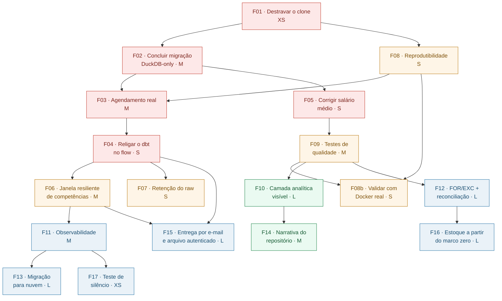

# Fatias de implementação — backlog

Cada fatia é uma unidade de trabalho **independentemente entregável**: dá para
parar depois de qualquer uma delas e o projeto continua num estado coerente.

> **Nada aqui foi aplicado ao código.** São propostas derivadas da
> [revisão de 21/09/2026](../revisao/01-sumario-executivo.md), para você decidir
> quais entram e em que ordem. As decisões que dependem de um julgamento seu
> (e não só de execução) estão em [docs/decisoes/](../decisoes/).

## Ordem sugerida

## Tabela

| # | Fatia | Esforço | Fase | Achados que resolve | Depende de |
|---|---|---|---|---|---|
| [F01](F01-destravar-o-clone.md) | Destravar o clone | XS | agora | M | — |
| [F02](F02-concluir-migracao-duckdb.md) | Concluir a migração DuckDB-only | M | agora | A, N | F01 |
| [F03](F03-agendamento-real.md) | Fazer o agendamento existir | M | agora | B, C, I | F02, F08 |
| [F04](F04-religar-dbt-no-flow.md) | Religar o dbt no flow | S | agora | (run_dbt comentado) | F03 |
| [F05](F05-corrigir-salario-medio.md) | Corrigir `salario_medio_admissao` | S | agora | D | F02 |
| [F06](F06-janela-resiliente.md) | Janela resiliente de competências | M | pré-prod | E | F04 |
| [F07](F07-retencao-e-permissoes.md) ✅ | Retenção do raw + não-root | S | pré-prod | G, I | F04 |
| [F08](F08-reprodutibilidade.md) | Reprodutibilidade do ambiente | S | pré-prod | J, K, L | F01 |
| [F08b](F08b-validar-reprodutibilidade-docker.md) ✅ | Validar com Docker real (F08 + F09 + revisão) | S | pré-prod | — | F08, F09 |
| [F09](F09-testes-de-qualidade.md) | Testes de qualidade ampliados | M | pré-prod | D, F | F05 |
| [F10](F10-camada-analitica.md) | Camada analítica visível | L | vitrine | (portfólio) | F09 |
| [F11](F11-observabilidade.md) ✅ | Observabilidade e alerta | M | produção | B | F06 |
| [F12](F12-for-exc-reconciliacao.md) 🟡 | Ingestão FOR/EXC + reconciliação | L | produção | H | F09 |
| [F13](F13-migracao-nuvem.md) | Migração para nuvem | L | produção | — | F11 |
| [F14](F14-narrativa-do-repositorio.md) | Narrativa do repositório | M | vitrine | (portfólio) | F10 |
| [F15](F15-entrega-por-email-e-arquivo.md) ✅ | Entrega por e-mail e arquivo autenticado | L | produção | (objetivo de produção) | F04, F06 |
| [F16](F16-estoque-a-partir-do-marco-zero.md) | Estoque a partir do marco zero | L | produção | (D11) | F12, F09 |
| [F17](F17-teste-de-silencio.md) ✅ | Teste de silêncio: provar que o alerta chega | XS (+ espera) | produção | (validação de F11) | F11 |

## Se você só tiver um fim de semana

`F01 → F02 → F05 → F04` já produz o maior salto: o projeto passa a **subir num
clone limpo**, a ter **uma única arquitetura coerente com a documentação**, e a
entregar **um número que não está errado**.

## Legenda de esforço

| | |
|---|---|
| **XS** | menos de 15 min |
| **S** | menos de 1 h |
| **M** | meio dia |
| **L** | 1 a 3 dias |
| **XL** | mais que isso |
